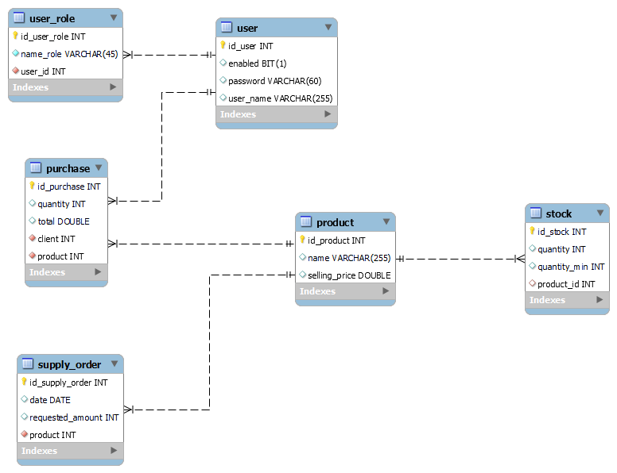

# Stock System

<h1>Smart Stock System for an Electronics Store</h1>

"First of all, do you understand what a smart stock system means? A stock system becomes intelligent when it uses IoT devices, such as sensors, to monitor inventory in real time and execute automated actions to optimize management. These actions not only improve operational efficiency—such as optimizing distribution routes and predicting demand—but also positively impact resource optimization and cost reduction, thereby enhancing service quality and customer satisfaction."
(https://www.mygestion.com/blog/tipos-de-stock)

### The project is expected to include the following points:
#### Initial Registration:

The process begins with the initial registration of all products that the company has in its inventory.

#### Product Entry:

Each time a new batch of products arrives at the warehouse or storage location, it is recorded in the system.

#### Product Stock Exit:

When a product is sold, the exit is recorded in the system.

#### Stock Level Monitoring:

The system continuously monitors the stock levels of each product.

#### Replenishment:

When a low stock alert is triggered, the replenishment process is initiated.

#### Tracking and Analysis:

In addition to monitoring stock levels, the system can provide detailed reports and analysis on inventory performance.

### The platform is expected to allow users to perform the following tasks at a minimum:
1. **Admin User**
   
    a. Add, remove, and modify organization products.
   
    b. Add a new stock batch for an organization product.
   
    c. View reports on product status in relation to their stock.
   
    d. Create a restocking order for a product.
   
2. **Customer User**
   
    a. Generate a new product purchase, which results in a decrease in stock (if applicable).
   
3. **General Users**
   
    a. Login.
   
    b. Logout.

---
## Branch Structure
- **main:**
Main branch of the project, representing the stable version of the code.

- **development:**
Intermediate branch where changes from different features developed by the team are integrated. It serves as a testing environment before merging changes into the **main** branch.

Each team member will create separate branches to develop assigned features. These branches will be based on the **development** branch and merged into it once the features are complete and tested.

## Team Members:
- [Luciano Moliterno [FrontEnd + DB + Inventory and Products]](https://github.com/LucianoMoliterno)
- [Braian Otondo [BackEnd + Configuration + Stock]](https://github.com/BraianOtondo)

## Class Diagram

---

## Technologies:

## Installation and Project Configuration
- Verify Dependencies
- Create Database
- Configure Environment Variables
- Compile the Project
- Load Test Data
- Run the Server

## Instructions

Ensure that Java JDK 17 is installed and compile the project before running the server.

### Check Java Version:
`java -version`

### Create the Database:
Run the script `\create-schema.sql`  
Run the script `\insert-ALL-data.sql` after compilation; this includes test data.

Username and Password: `admin` `admin`  
Username and Password: `auditor` `auditor`

### Configure Environment Variables:
In `\src\main\resources\application.yml`  
Modify the properties `url:`, `username:`, and `password:`

### Compile the Project with Maven:
Deleting old files: `mvn clean install`  
Only compilation: `mvn install`

### Run the Spring Boot Server:
`mvn spring-boot:run`

### Stop the Spring Boot Server:
Press `Ctrl + c`

---

Licensed under [CC BY-NC-SA 4.0](https://creativecommons.org/licenses/by-nc-sa/4.0/)  
*Tools/logos are property of their respective companies.*
